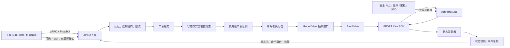
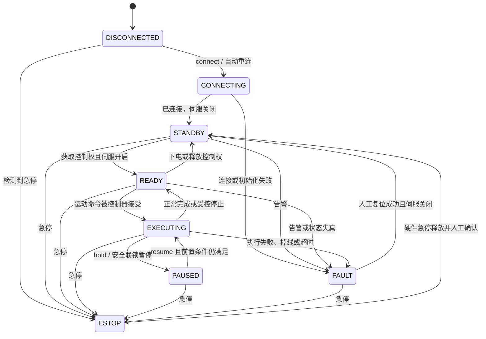

# 工业机械臂控制服务设计方案

## 1. 文档目的

本文给出一个基于机械臂厂商 C++ SDK、面向上层应用提供统一服务接口的生产级设计。当前仓库包含 EFORT C++ SDK，因此示例以 EFORT 为首个适配器，但核心层不依赖 EFORT 类型和函数，后续可增加其他品牌机械臂而不改变上层接口。

本方案面向“控制器已经完成轨迹规划和伺服闭环，服务负责下发运动指令、管理生命周期并聚合状态”的典型工业应用。服务不是硬实时伺服控制器，也不能替代安全 PLC、急停、围栏、光栅、STO 等经过安全认证的硬件回路。

## 2. 设计目标与边界

### 2.1 目标

- 将厂商 SDK 隔离在适配器层，对外提供稳定、版本化、厂商无关的 API。
- 保证同一台机械臂只有一个控制者和一个 SDK 写入线程，避免并发调用导致未定义行为。
- 支持连接、上/下电、控制权、点动、MoveJ、MoveL、MoveC、暂停、继续、停止、程序控制、I/O、状态和告警。
- 所有运动命令都经过状态、参数、软限位、坐标系和控制权检查。
- 命令异步执行，可查询、取消、超时，并产生完整的审计记录。
- 网络中断、SDK 阻塞、控制器掉线、进程重启等故障都能进入确定且保守的状态。
- 支持 Mock/仿真适配器，使大部分业务逻辑无需真实机械臂即可测试。

### 2.2 非目标

- 不在普通 Linux 用户态进程中实现 1 kHz 伺服闭环或安全功能。
- 第一阶段不负责通用离线轨迹规划、三维碰撞检测和多机械臂协同规划；这些能力应由专门规划层提供，控制服务只执行已经验证的目标或轨迹。
- 不把厂商 SDK 的结构体、返回码、默认参数直接暴露给上层应用。
- 不允许上层绕过服务直接访问同一控制器，否则控制权、状态机和审计将失效。

## 3. 总体架构

代码按“框架 + 可选扩展 + 应用组装”构建：`robot_core` 只包含领域、
命令执行、租约和安全检查，不编译具体驱动、YAML 或网络协议。
`robot_mock`、`robot_efort`、`robot_grpc` 分别在自己的适配器目录维护
CMake 目标，并通过构建选项启用；EFORT 和 gRPC 默认关闭。
YAML 部署配置属于 `robot_config`，仅随示例应用或测试构建。

扩展边界沿用两个接口：设备驱动实现 `IRobotDriver`，传输适配器调用
`RobotService`。`apps/robot_manager` 负责选择驱动、构造执行器和启动传输。
添加扩展只需实现相应接口并在应用组装处接入，核心不增加厂商或协议分支。
当前使用编译时链接，不引入动态插件加载和全局自动注册。

推荐“一台机械臂控制器对应一个服务实例”。一个实例内部可以只有一个进程；若厂商 SDK 有崩溃、死锁或不可中断调用的历史问题，则进一步把 `sdk-worker` 拆成子进程，通过本机 Unix Domain Socket 通信，由主进程监护并重启。



关键原则如下：

1. 网络线程不直接调用厂商 SDK，只完成鉴权、反序列化、校验和入队。
2. 除非 SDK 文档明确保证线程安全，否则所有改变机械臂状态的 SDK 调用由单一执行线程串行完成。
3. 停止类命令具有最高优先级，不能排在普通运动命令之后；必要时使用 SDK 明确允许的独立中断通道。
4. 状态采集与命令执行解耦，向上层发布带时间戳、序列号和新鲜度的不可变状态快照。
5. 服务重启后默认不恢复运动、不自动上电，也不自动清除急停或安全告警。

## 4. 推荐技术选型

| 类别     | 推荐方案                   | 说明                                                           |
| -------- | -------------------------- | -------------------------------------------------------------- |
| 语言     | C++17                      | 全项目固定使用 ISO C++17，禁用编译器扩展，并兼顾厂商 SDK ABI   |
| 构建     | CMake 3.22+ + CMakePresets | 预设固定 Debug/Release、SDK 与 gRPC 选项及构建目录             |
| 对外协议 | gRPC + Protobuf            | 强类型、代码生成、双向/服务端流、截止时间和版本演进能力较好    |
| 管理接口 | 可选 HTTP/REST             | 只用于健康检查、版本和配置查询，不建议用于连续点动或高频控制   |
| 配置     | 版本化 YAML 文件           | 启动时严格解析`schema_version: 1`；未知或无效字段失败即停    |
| 日志     | stderr/journald（首版）    | 后续增加 JSON 结构化日志和审计字段                             |
| 指标     | 待接入 Prometheus exporter | 规划连接、时延、队列、告警和状态新鲜度指标                     |
| 测试     | 自包含 CTest（当前）       | 后续引入 GoogleTest/GoogleMock 做契约、故障注入和 HIL 分层     |
| 部署     | Linux systemd              | 当前 SDK 为`.so`，优先部署在工业 PC/边缘控制器；非 root 运行 |

如果现有系统已经统一使用 ROS 2，可增加 `adapters/ros2`，将 ROS 2 Action/Service/Topic 转为内部命令和状态模型；领域层与 EFORT 适配器仍不应依赖 ROS 2。

### 4.1 C++17 与 Google 编码规范基线

项目采用 ISO C++17 和 [Google C++ Style Guide](https://google.github.io/styleguide/cppguide.html) 作为统一编码基线。第三方 SDK 头文件和自动生成的 Protobuf/gRPC 文件不做格式改写，其余自有代码必须遵守以下规则：

- CMake 设置 `CMAKE_CXX_STANDARD 17`、`CMAKE_CXX_STANDARD_REQUIRED ON` 和 `CMAKE_CXX_EXTENSIONS OFF`；GCC/Clang 构建结果必须包含 `-std=c++17`，不得依赖 GNU 扩展。
- 不使用 C++20 功能，包括 concepts、`std::span`、`std::jthread`、`std::stop_token`、ranges 和指定初始化器。线程停止使用 C++17 可用的原子标志、条件变量和 RAII 封装。
- 类型和枚举使用 `UpperCamelCase`，函数使用 `UpperCamelCase`，变量和参数使用 `snake_case`，类数据成员使用尾下划线，例如 `state_mutex_`。
- 常量使用 `kUpperCamelCase`，命名空间使用小写 `snake_case`，宏使用 `UPPER_SNAKE_CASE`；除头文件保护和平台适配外尽量不使用宏。
- 自有文件采用小写下划线命名，并使用 Google 常见的 `.h`/`.cc` 后缀；测试文件以 `_test.cc` 结尾。
- 头文件必须自包含，使用项目路径形式的 `#include` 和唯一 include guard，例如 `ROBOT_DRIVER_ROBOT_DRIVER_H_`；禁止在头文件中使用 `using namespace`。
- include 顺序为对应头文件、C 系统头、C++ 标准库、其他库、项目头文件，各组之间空一行。EFORT 等第三方头文件通过薄适配头隔离，减少其宏和全局符号扩散。
- 使用 RAII 和明确所有权；默认使用值语义，独占所有权使用 `std::unique_ptr`，共享所有权只有在生命周期确实共享时才使用 `std::shared_ptr`。裸指针默认表示不拥有对象。
- 对单参数构造函数使用 `explicit`，重写虚函数使用 `override`，禁止 C 风格强制转换，优先使用 `nullptr`、范围 `for`、`enum class` 和 `std::chrono` 类型。
- 服务内部不依靠异常跨层传递运行期错误。由于 C++17 没有 `std::expected`，统一使用 `Status` 和 `StatusOr<T>`；EFORT SDK 的整数返回码在适配层立即转换。构造阶段异常必须在进程边界捕获并转换为启动失败。
- 使用项目根目录的 `.clang-format`，内容以 `BasedOnStyle: Google` 为基线；CI 对自有 `.h/.cc` 执行 `clang-format --dry-run --Werror`。
- 使用 `.clang-tidy` 执行 `bugprone-*`、`performance-*`、`modernize-*` 和适用的 `google-*` 检查。SDK/生成代码目录排除在检查之外，告警豁免必须附原因。
- 编译器至少启用 `-Wall -Wextra -Wpedantic -Wconversion -Wsign-conversion`；CI 将自有代码告警视为错误，第三方 SDK 告警通过 `SYSTEM` include 隔离。

项目的 CMake 语言设置至少包含：

```cmake
set(CMAKE_CXX_STANDARD 17)
set(CMAKE_CXX_STANDARD_REQUIRED ON)
set(CMAKE_CXX_EXTENSIONS OFF)
```

项目根目录 `.clang-format` 至少包含：

```yaml
BasedOnStyle: Google
Language: Cpp
ColumnLimit: 80
```

格式化工具只解决布局，不能替代命名、所有权、错误处理和接口设计检查。代码评审以仓库固定版本的 `.clang-format`、`.clang-tidy` 和 CI 结果为准，避免开发机版本差异。

## 5. 标准目录树（层次概览）

目录按“接口契约、领域模型、应用编排、厂商适配、基础设施”分层。完整的逐文件职责说明见 5.1；下面保留不带注释的层次概览，便于快速浏览。

```text
robot_manager/
├── CMakeLists.txt
├── CMakePresets.json
├── .clang-format
├── .clang-tidy
├── .editorconfig
├── .gitignore
├── README.md
├── cmake/
│   ├── CompilerWarnings.cmake
│   ├── FindEfortSdk.cmake
│   └── FindgRPC.cmake
├── api/
│   └── proto/
│       └── robot/
│           └── v1/
│               └── robot_control.proto
├── config/
│   └── robots/
│       ├── er150_2700.yaml
│       ├── er7_900.yaml
│       └── er155_3200.yaml
│       └── mock.yaml
├── docs/
│   ├── design.md
│   └── sdk_integration.md
├── include/
│   └── robot/
│       ├── version.h.in
│       ├── domain/
│       │   ├── types.h
│       │   ├── command.h
│       │   ├── status.h
│       │   ├── model_registry.h
│       │   └── state_machine.h
│       ├── service/
│       │   ├── command_executor.h
│       │   └── control_lease.h
│       ├── driver/
│       │   └── robot_driver.h
│       ├── safety/
│       │   └── command_guard.h
│       ├── config/
│       │   └── config_loader.h
│       └── (application transport lives under apps/robot_manager/transport)
├── src/
│   ├── domain/
│   │   ├── model_registry.cc
│   │   └── state_machine.cc
│   ├── service/
│   │   ├── command_executor.cc
│   │   └── control_lease.cc
│   ├── safety/
│   │   └── command_guard.cc
│   ├── config/
│   │   └── config_loader.cc
│   └── adapters/
│       ├── (gRPC transport lives under apps/robot_manager/transport)
│       ├── efort/
│       │   ├── efort_driver.h
│       │   ├── efort_driver.cc
│       │   ├── efort_error_mapper.h
│       │   └── efort_error_mapper.cc
│       └── mock/
│           ├── mock_driver.h
│           └── mock_driver.cc
├── apps/
│   ├── robot_manager/main.cc
│   └── robotctl/main.cc
├── tests/
│   └── unit/robot_unit_tests.cc
├── deploy/
│   ├── systemd/robot-manager.service
│   └── scripts/
│       ├── build_linux.sh
│       ├── validate_linux.sh
│       └── verify_efort_sdk.sh
└── 3rdparty/
    └── efort_sdk/
        ├── include/
        ├── lib/
        └── docs/
```

`3rdparty/efort_sdk` 只放有合法分发授权的头文件、动态库和手册。若授权不允许提交二进制，应改为安装时注入，并由 `FindEfortSdk.cmake` 查找。动态库的 ABI、架构、glibc/libstdc++ 版本必须在构建和启动阶段校验。

### 5.1 目录树逐文件职责

上面的目录树给出层次关系，下面在同一目录结构中补充每个文件的职责。注释中的“接口”指声明和数据契约，“实现”指具体行为；这样可以快速判断新代码应该放在哪一层。

```Shell
robot_manager/                         # 项目根目录
├── CMakeLists.txt                     # 编译选项、库/可执行文件、依赖和安装规则
├── CMakePresets.json                  # Mock Debug/Dev、EFORT Release 的可复现构建/测试预设
├── .clang-format                      # C++ 格式化规则，以 Google 风格和 80 列为基线
├── .clang-tidy                        # bugprone、modernize、performance 等静态检查规则
├── .editorconfig                      # 编辑器通用规则，如 UTF-8、LF、缩进和末尾换行
├── .gitignore                         # 忽略 build、CMake 缓存和编译数据库等本地产物
├── README.md                          # 项目简介、构建入口、运行方式和快速上手说明
├── cmake/                             # CMake 可复用模块
│   ├── CompilerWarnings.cmake         # 为自有目标统一启用编译器告警策略
│   ├── FindEfortSdk.cmake             # 查找 EFORT SDK 并导出 EfortSdk::EfortSdk 目标
│   └── FindgRPC.cmake                 # 优先官方 gRPC 包，并兼容发行版头文件/库回退查找
├── api/                               # 对外接口契约
│   └── proto/robot/v1/
│       └── robot_control.proto        # robot.v1 gRPC 服务及请求/响应消息定义
├── config/robots/                     # 可复制后修改的部署配置样例
│   ├── er150_2700.yaml        # ER150-2700 的 YAML 样例和安全默认值
│   ├── er7_900.yaml           # ER7-900 的 YAML 样例和安全默认值
│   └── er155_3200.yaml        # ER155-3200 的 YAML 样例和安全默认值
│   └── mock.yaml               # 不连接真实控制器的本地 Mock 验证配置
├── docs/
│   ├── design.md                      # 总体架构、领域模型、状态机、API、安全和实施方案
│   └── sdk_integration.md             # EFORT SDK 版本、ABI、架构和 HIL 核对结果
├── include/robot/                     # 可复用的领域、应用和驱动接口头文件
│   ├── domain/                        # 不依赖具体厂商和传输协议的核心模型
│   │   ├── types.h                    # 单位明确的位姿、关节、快照、告警和驱动参数类型
│   │   ├── command.h                  # 命令种类、载荷、状态、记录和幂等数据结构
│   │   ├── status.h                   # C++17 的统一 Status/StatusOr 错误结果类型
│   │   ├── model_registry.h            # 型号枚举、资料、名称解析和控制器匹配接口
│   │   └── state_machine.h             # 推导 DISCONNECTED/READY/FAULT 等生命周期状态
│   ├── version.h.in                    # CMake 模板；构建时生成版本、Git、时间和编译器信息头
│   ├── service/                       # 面向用例的编排接口
│   │   ├── command_executor.h          # 有界队列、优先级、幂等和命令生命周期接口
│   │   └── control_lease.h             # 控制租约获取、续租、释放和过期校验接口
│   ├── driver/                        # 厂商无关的驱动抽象
│   │   └── robot_driver.h              # 连接、运动、程序、I/O、状态和告警统一接口
│   ├── safety/
│   │   └── command_guard.h             # 租约、状态、参数、限位和工作区检查接口
│   ├── config/
│   │   └── config_loader.h             # 版本化 YAML 配置模型和严格加载/校验接口
│   └── (应用传输层位于 apps/robot_manager/transport)
├── src/                               # 自有实现，不放生成的 Protobuf 源码
│   ├── domain/
│   │   ├── model_registry.cc           # 实现型号规范化、解析、资料查询和匹配
│   │   └── state_machine.cc             # 实现快照到生命周期状态的确定性推导
│   ├── application/
│   │   ├── command_executor.cc          # 串行调度驱动调用，维护命令状态、超时和幂等记录
│   │   └── control_lease.cc             # 实现线程安全的租约生成、续期、释放和过期判断
│   ├── safety/
│   │   └── command_guard.cc             # 实现运动、点动、程序、速度和 I/O 安全校验
│   ├── config/
│   │   └── config_loader.cc             # 解析受支持 YAML 子集，并把配置转换为领域/服务选项
│   └── adapters/                       # 外部协议和具体厂商的边界转换
│       ├── (gRPC 实现位于 apps/robot_manager/transport)
│       ├── efort/
│       │   ├── efort_driver.h              # robot_efort 私有实现声明
│       │   ├── efort_driver.cc     # 统一驱动调用到 EFORT SDK 的映射及状态轮询
│       │   ├── efort_error_mapper.h      # EFORT 错误映射的适配器内部声明
│       │   └── efort_error_mapper.cc     # SDK 返回码到统一 Status 的转换
│       └── mock/
│           ├── mock_driver.h               # robot_mock 私有实现声明
│           └── mock_driver.cc      # 无真实控制器的确定性模拟驱动和故障注入
├── apps/
│   ├── robot_manager/main.cc             # 读取 YAML 配置、组装组件、启动服务和处理 SIGTERM
│   └── robotctl/main.cc                  # 开发/运维 CLI，查询型号和机器人状态
├── tests/
│   └── unit/robot_unit_tests.cc           # CTest 单元/集成测试，覆盖核心链路和 Mock 驱动
├── deploy/
│   ├── systemd/robot-manager.service     # systemd 单元、非 root 运行和进程隔离策略
│   └── scripts/
│       ├── build_linux.sh                # 校验 SDK、构建 Release 并运行 CTest
│       ├── validate_linux.sh             # 验证 Mock Debug 和 EFORT Release 两套构建
│       └── verify_efort_sdk.sh           # 校验 SDK 文件、ELF 架构、依赖库和版本标识
└── 3rdparty/efort_sdk/                  # 经授权分发或部署注入的 EFORT 原始 SDK
    ├── include/
    │   ├── EfortSdk.h                   # EFORT SDK 主 API 声明
    │   ├── SdkConstDef.h                # SDK 常量、版本标识和枚举定义
    │   └── SdkStructDef.h               # SDK 参数、状态和位置结构体定义
    ├── lib/
    │   ├── libEftSdk.so                # EFORT SDK 主动态库
    │   ├── libEftSdkd.so               # SDK 调试版本动态库
    │   ├── liblog4cpp.so               # log4cpp 主库链接名
    │   ├── liblog4cpp.so.2.9           # log4cpp ABI 主版本链接文件
    │   ├── liblog4cpp.so.2.9.1         # log4cpp 具体版本库文件
    │   ├── librlibcpp.bcc.so           # SDK 运行时库链接名
    │   ├── librlibcpp.bcc.so.1         # SDK 运行时库 ABI 主版本链接文件
    │   ├── librlibcpp.bcc.so.1.0.0.2   # SDK 运行时库具体版本文件
    │   ├── librlibcpp.tool.so          # SDK 工具运行库链接名
    │   ├── librlibcpp.tool.so.1        # SDK 工具运行库 ABI 主版本链接文件
    │   └── librlibcpp.tool.so.1.0.0.2  # SDK 工具运行库具体版本文件
    └── docs/
        └── C++SDK使用手册_V2.8.pdf     # 厂商 API、返回码和运行约束参考手册
```

依赖方向为：`api` 只描述外部契约；`include/robot/domain` 不依赖 EFORT、gRPC
或 CLI；`application` 编排领域用例；`safety` 在命令进入驱动前做统一防护；
`src/adapters` 承担传输层和厂商 SDK 的边界转换；`apps` 负责组装和进程生命周期。
因此上层业务不会直接依赖 `EfortSdk.h`，Mock 驱动也可以替换真实驱动完成大部分测试。

当前工作区中可能出现的 `CMakeCache.txt`、`CMakeFiles/`、`build/`、生成的
`robot_control.pb.*`/`robot_control.grpc.pb.*` 和 `compile_commands.json` 是 CMake
或代码生成器产物，不属于源码目录树，也不应提交到 Git；根目录 `.gitignore` 已忽略
其中常见的构建产物。

## 6. 核心领域模型

### 6.1 强类型数据

内部模型不能直接复用 `RobotAPI::RobotPos`、`RobotJoint` 等 SDK 类型，建议至少定义：

- `RobotId`、`CommandId`、`ClientId`、`LeaseId`；
- `JointPosition`、`JointVelocity`，固定或受控长度并携带轴数；
- `CartesianPose`，明确工件坐标系；服务与 EFORT 边界统一使用毫米、度和控制器构型位；
- `ToolFrame`、`WorkObjectFrame`；
- `MotionProfile`，包含速度、加速度、减速度、加加速度和转弯区；
- `RobotState`、`CommandStatus`、`RobotError`；
- `SteadyTime` 用于超时，`SystemTime` 用于跨系统审计。

对外协议必须明确单位，禁止依赖“SDK 默认单位”。EFORT 使用毫米、度和整数
速度百分比，相关映射集中在 `efort_driver.cc`；浮点值必须检查 `NaN`、
无穷大和取值范围。

### 6.2 服务状态机

建议使用服务自身的状态机统一不同厂商的状态表达：



状态转移应同时依据 SDK 返回值和随后采集到的控制器真实状态。例如 `PowerOn()` 返回成功只表示请求被接受，只有 `GetCurrentServoStatus()` 确认后才能进入 `READY`。

### 6.3 控制租约

上层应用执行有副作用的操作前必须持有控制租约：

- 同一机器人同一时刻只允许一个活动租约；HMI 只读客户端无需租约。
- 租约包含 `lease_id`、持有者、权限、有效期和心跳期限。
- 租约超时后拒绝新运动命令，并按照配置执行受控停止；不建议仅因普通查询客户端掉线就下电。
- 命令提交和真正执行前都要校验租约；旧租约到期后即使新客户端已取得新租约，也不能掩盖旧租约所属运动的停止条件。
- 主动释放租约等同于放弃控制责任：取消尚未执行的有副作用命令，并对该租约正在执行的运动或点动请求受控停止。
- `Stop`、安全联锁和管理员紧急处置不受普通租约阻挡。
- 点动要求更短的心跳（例如 100 ms 发送一次，300 ms 未刷新即停止），不得使用一个无期限的 `JogStart`。

## 7. 驱动抽象与 EFORT 映射

`IRobotDriver` 是厂商边界。它不包含网络、Protobuf、日志策略或业务重试，仅负责把规范化调用映射为 SDK 调用，并把 SDK 结果映射为统一错误。

建议接口能力如下：

```cpp
class IRobotDriver {
 public:
  virtual ~IRobotDriver() = default;

  virtual Status Connect(const ConnectionOptions& options) = 0;
  virtual Status Disconnect() = 0;
  virtual Status AcquireControl() = 0;
  virtual Status ReleaseControl() = 0;
  virtual Status PowerOn() = 0;
  virtual Status PowerOff() = 0;
  virtual Status ClearFault() = 0;

  virtual Status MoveJ(const JointTarget& target,
                       const MotionProfile& profile) = 0;
  virtual Status MoveL(const CartesianTarget& target,
                       const MotionProfile& profile) = 0;
  virtual Status MoveC(const CircularTarget& target,
                       const MotionProfile& profile) = 0;
  virtual Status Hold() = 0;
  virtual Status Resume() = 0;
  virtual Status Stop(StopMode mode) = 0;
  virtual Status Jog(const JogCommand& command) = 0;

  virtual StatusOr<RobotSnapshot> ReadState() = 0;
  virtual StatusOr<std::vector<Alarm>> ReadAlarms() = 0;
  virtual StatusOr<bool> ReadDigitalInput(std::uint32_t index) = 0;
  virtual Status WriteDigitalOutput(std::uint32_t index,
                                    bool value) = 0;
};
```

这里的 `Status` 和 `StatusOr<T>` 是 `domain/status.h` 中项目自有的 C++17
错误类型，不是 C++23 的 `std::expected`。接口方法采用 UpperCamelCase，类名
不使用 `I` 前缀，符合本项目采用的 Google 风格基线。

EFORT 首期映射关系：

| 统一能力          | EFORT SDK                                                              |
| ----------------- | ---------------------------------------------------------------------- |
| 连接/断开         | `ConnectRobot` / `DisconnectRobot` / `IsConnected`               |
| 获取/释放控制权   | `EnableApiControl(true/false)` / `IsApiControl`                    |
| 上电/下电         | `PowerOn` / `PowerOff`                                             |
| 速度倍率          | `SetGlobalSpeed`；当前值来自 `GetRobotStatusData`                  |
| 清除普通告警      | `ClearAlarm`，调用前必须检查急停和联锁                               |
| MoveJ/MoveL/MoveC | `MJOINT` / `MLIN` / `MCIRC`                                      |
| 暂停/继续/清理    | `MOVEHOLD` / `MOVERESUME` / `MOVECLEAR`                          |
| 多段运动          | 优先评估`MultiMove2Start` 系列，并用契约测试确认语义                 |
| 点动              | `SetJogMode` + `JogNPlus/Minus`，必须配套服务端心跳停止            |
| 状态              | `GetRobotStatusData`、`GetJointPos`、`GetBaseCoordinatePos2`     |
| 伺服/急停/告警    | `GetCurrentServoStatus` / `GetCurrentEmgStatus` / `GetAlarmData` |
| 工具/工件坐标系   | `SetCurrentToolByName` / `SetCurrentUframeByName` 及查询接口       |
| I/O               | `ReadDIn` / `ReadDOut` / `WriteDOut`                             |
| 可达性初检        | `CheckTarget`；不能替代完整碰撞和路径检查                            |

需要通过真实控制器验证以下 SDK 语义后再固化实现：函数返回是“已接受”还是“已完成”、阻塞函数能否被停止打断、重连参数是否会阻塞、不同接口能否跨线程调用、速度和姿态单位、`MOVECLEAR` 对控制器队列的影响、告警码文档及多段运动的完成条件。

## 8. 命令执行模型

### 8.1 异步命令生命周期

运动 RPC 不应一直阻塞到机械臂运动完成。推荐流程：

1. API 收到请求，校验身份、租约、协议版本、幂等键和基本格式。
2. `CommandGuard` 检查服务状态、急停、伺服、联锁、关节/笛卡尔范围、工具和工件坐标系。
3. 创建 `command_id`，持久记录请求摘要，将命令置为 `QUEUED` 并立即返回。
4. 执行线程二次检查实时状态后调用驱动，状态变为 `DISPATCHED/RUNNING`。
5. 状态采集器根据控制器运动状态和目标容差判定 `SUCCEEDED`；失败、取消、停止、超时分别进入终态。
6. 上层通过事件流或 `GetCommand` 获得终态，不能只依赖 RPC 调用成功。

命令状态建议为：

```text
RECEIVED -> VALIDATED -> QUEUED -> DISPATCHED -> RUNNING
                                            ├-> SUCCEEDED
                                            ├-> FAILED
                                            ├-> CANCELLED
                                            ├-> TIMED_OUT
                                            └-> STOPPED
```

每个提交请求必须支持 `idempotency_key`。服务在限定时间窗口内收到相同客户端、相同键和相同请求体时返回原 `command_id`；键相同但请求体不同则拒绝，防止网络重试导致重复运动。

### 8.2 队列与优先级

建议只允许一个普通运动命令处于 `RUNNING`，队列使用有界容量并分级：

| 优先级 | 命令                                 | 行为                   |
| ------ | ------------------------------------ | ---------------------- |
| P0     | 急停状态处理、Stop                   | 抢占普通命令，立即处理 |
| P1     | Hold、PowerOff、安全联锁动作         | 高优先级控制命令       |
| P2     | Resume、ClearFault、控制权和配置切换 | 必须经过状态机         |
| P3     | MoveJ/MoveL/MoveC、程序运行、I/O 写  | 常规命令               |

队列满时返回 `RESOURCE_EXHAUSTED`，禁止无限堆积。是否允许预排多个运动命令应由配置显式控制；首版建议最多一个运行命令加一个待执行命令，以降低取消和故障恢复的复杂度。
已结束命令和幂等键也必须采用有界保留窗口；当前实现默认最多保留 4096 条命令，淘汰最旧的终态记录，避免边缘服务长期运行时内存无限增长。上层不得在保留窗口过后复用幂等键。

### 8.3 线程模型

推荐单进程初版至少包含：

- gRPC 线程池：请求处理和状态流发送；不调用 SDK。
- 命令执行线程：唯一 SDK 写入者，执行有副作用调用。
- 状态采集线程：以 20～100 Hz 读取状态，实际频率按 SDK 能力和网络负载压测确定。
- 看门狗线程：检查状态新鲜度、执行超时、租约和点动心跳。
- 日志/指标后台线程：不得阻塞控制路径。

若 SDK 明确不允许读写并发，则状态读取也经由同一个 SDK 调度器串行化。不要在持有全局互斥锁时执行可能长时间阻塞的网络 RPC；若 SDK 调用无法设置超时，应优先采用独立 `sdk-worker` 进程实现故障隔离。

## 9. 对外 API 设计

API 使用包名 `robot.v1`。破坏兼容性的变化发布为 `v2`，同一主版本内只增加可选字段或新方法，不复用已经删除的 Protobuf 字段编号。

### 9.1 服务划分

```proto
service RobotControlService {
  rpc AcquireControlLease(AcquireControlLeaseRequest) returns (ControlLease);
  rpc RenewControlLease(RenewControlLeaseRequest) returns (ControlLease);
  rpc ReleaseControlLease(ReleaseControlLeaseRequest)
      returns (google.protobuf.Empty);

  rpc SubmitCommand(CommandRequest) returns (CommandAccepted);
  rpc GetCommand(GetCommandRequest) returns (Command);
  rpc GetState(GetStateRequest) returns (RobotState);
  rpc StreamState(StreamStateRequest) returns (stream RobotState);
  rpc ReadAlarms(GetStateRequest) returns (AlarmList);
  rpc ReadDigitalInput(ReadDigitalIoRequest) returns (DigitalIoValue);
  rpc ReadDigitalOutput(ReadDigitalIoRequest) returns (DigitalIoValue);
}
```

所有写操作（上/下电、运动、点动、程序和数字输出）统一通过
`SubmitCommand` 进入同一条幂等、限流和串行执行链路，避免多个 RPC 旁路命令守卫。
点动首版使用重复提交的短周期 `Jog(start=true)` 作为心跳；后续可在保持相同看门狗
语义的前提下增加双向流接口。每个周期心跳是一个新的逻辑命令，必须使用新的
`idempotency_key`；相同键只表示同一次网络请求的重试，不刷新 300 ms 看门狗。
普通轨迹和控制器程序只允许在自动模式启动；点动只允许在控制器手动模式启动，
并继续受伺服、租约、速度上限和 300 ms 心跳约束。

### 9.2 请求必备字段

所有有副作用的请求应包含：

- `robot_id`：目标机械臂；
- `lease_id`：控制租约，Stop 等特权命令除外；
- `idempotency_key`：客户端生成的唯一键；
- `deadline` 或 `max_queue_duration`：命令最迟何时开始；
- `expected_state_version`：可选的乐观并发控制；
- `trace_id`：可由网关生成，贯穿日志和事件。

运动请求还应包含 `tool_frame`、`work_object_frame`、速度/加速度参数、转弯区、目标容差和最大执行时间。服务端使用的最终限值取“请求值、机器人配置上限、当前安全模式上限”中的最小值。

### 9.3 状态快照

`RobotState` 至少包含：

- `robot_id`、单调递增 `sequence`、控制器时间和服务接收时间；
- 连接、控制权、伺服、急停、安全联锁、运动、程序和告警状态；
- 当前关节位置/速度、TCP 位姿、工具和工件坐标系；
- 全局速度倍率、当前命令 ID、数字 I/O 摘要；
- `quality`：`GOOD/STALE/UNKNOWN` 以及距最后成功采集的时间。

当前 `robot.v1` 已提供连接/控制/伺服/急停/告警/运动/暂停/程序、关节位置、
TCP 位姿、工具、工件坐标系、速度倍率和单调序号；状态超过
`service.state_stale_after_ms` 后生命周期置为 `UNKNOWN`，并保留最后成功采集
时间，对外提供 `state_age_ms/state_stale`。关节速度、显式多级 `quality` 和当前
命令 ID 作为兼容性新增字段后续补充。

当状态超过配置的新鲜度阈值（例如 500 ms）时必须标记 `STALE`，不能继续把最后一次值当作实时值。上层应以 `sequence` 处理断线重连和事件去重。

## 10. 参数检查与软件防护

每个运动命令在入队前和执行前各检查一次：

1. 连接有效、控制权有效、非急停、无阻止运动的告警。
2. 运行模式允许远程控制，伺服状态满足要求。
3. 控制租约和点动心跳有效，无其他运行命令冲突。
4. 关节数量正确，每轴角度、速度、加速度和 jerk 在配置范围内。
5. TCP 目标位于允许工作空间内，不落入禁入区。
6. 工具、负载、工件坐标系名称存在且与请求一致。
7. 姿态、单位、速度倍率、转弯半径和超时合法。
8. 使用 SDK `CheckTarget` 或 IK 做可达性初检；若需要路径碰撞保证，必须接入专用规划器。
9. 状态快照未过期，配置版本和校准版本符合预期。

软限位和禁入区只是纵深防御，不属于认证安全功能。人机协作、速度与间距监控、功率和力限制等场景需按风险评估使用符合 ISO 10218、ISO/TS 15066、IEC 60204-1 或当地适用规范的安全系统，并由具备资质的人员验证。

## 11. 停止、故障和恢复策略

### 11.1 停止语义

统一定义三类停止，不把含义含混的 `stop()` 暴露给业务：

- `CONTROLLED_STOP`：按控制器能力减速停止，保留伺服；用于取消普通运动或租约超时。
- `QUICK_STOP`：控制器支持时采用更快停止；触发条件需在风险评估中定义。
- `POWER_OFF_REQUEST`：请求伺服下电，不等价于安全回路中的 STO。

急停只能来自经过认证的硬件安全回路或控制器安全接口。软件收到急停状态后要立即拒绝新运动、终结当前命令、发布事件和记录审计，但不能宣称普通 RPC 实现了安全急停。

### 11.2 故障分类

| 类别         | 示例                          | 默认处理                                   |
| ------------ | ----------------------------- | ------------------------------------------ |
| 请求错误     | 参数越界、坐标系不存在        | 拒绝命令，不改变机器人状态                 |
| 前置条件错误 | 未持有租约、伺服未开启        | 返回明确条件，不自动上电                   |
| 暂态通信错误 | 短暂超时、连接闪断            | 进入状态未知，停止派发；指数退避重连       |
| 控制器告警   | 运动学错误、驱动器告警        | 终止命令并进入`FAULT`，等待人工判断      |
| 安全事件     | 急停、围栏打开、安全 PLC 禁止 | 进入`ESTOP/FAULT`，禁止自动清除          |
| SDK 内部故障 | 崩溃、死锁、异常返回          | 隔离/重启 worker，状态保持未知且不恢复运动 |

自动重连只恢复“通信”，不恢复控制租约、伺服和未完成运动。普通通信故障可自动重试只读查询；上电、运动、I/O 写和清告警不得在不知道前一次执行结果时盲目重试，必须依靠幂等记录和真实状态协调。

## 12. 错误模型

统一错误包含：

```text
category       INVALID_ARGUMENT / FAILED_PRECONDITION / CONFLICT /
               UNAVAILABLE / TIMEOUT / CONTROLLER_FAULT / INTERNAL
code           稳定的服务错误码，例如 ROBOT_NOT_READY
message        面向操作者的简短说明
retryable      是否可以安全重试
vendor_code    原始 EFORT 返回码，仅诊断使用
vendor_message 厂商说明，仅诊断使用
context        robot_id、command_id、state、API 名称
```

SDK 返回码只在 `efort_error_mapper.cc` 出现。对外业务逻辑只能依赖稳定的服务错误码。日志中不得只记录“调用失败”，必须记录调用名、耗时、统一错误、厂商错误和当时状态，但不记录密码、令牌等敏感信息。

## 13. 配置设计

示例配置：

```yaml
schema_version: 1

service:
  instance_id: robot-01-edge-a
  grpc_listen: 127.0.0.1:50051
  state_poll_ms: 50
  state_stale_after_ms: 500
  command_queue_capacity: 16
  command_history_capacity: 4096

robot:
  id: robot-01
  driver: efort
  address: 192.168.10.20
  model: ER7-900
  verify_sdk_version: true
  sdk_debug_logging: false

control_lease:
  ttl_ms: 3000
  jog_heartbeat_timeout_ms: 300

limits:
  motion_enabled: false
  program_execution_enabled: false
  maximum_joint_speed_percent: 50
  maximum_linear_speed_mm_per_second: 500
  joint_limits_deg:
    - -170:170
    - -90:140
    - -155:80
    - -185:185
    - -120:120
    - -350:350
  cartesian_workspace:
    frame: wobj0
    x_mm: -1500:1500
    y_mm: -1500:1500
    z_mm: 0:2000
  writable_digital_outputs:
    - 0
    - 1
  approved_programs:
    - approved-program

security:
  grpc:
    allow_insecure_loopback: true
    # Production: set this false and configure all four mTLS settings below.
    # client_ca_file: /etc/robot-manager/pki/clients-ca.pem
    # server_certificate_chain_file: /etc/robot-manager/pki/server.pem
    # server_private_key_file: /etc/robot-manager/pki/server-key.pem
    # allowed_client_common_names:
    #   - robot-hmi
```

以上限值只是结构示例，不能直接用于真实机械臂。实际值必须来自具体型号手册、现场标定和风险评估。生产环境配置要有 schema 校验、版本号、校验和、变更人和审计记录；关键配置无效时服务应拒绝启动。

当前落地版本从 YAML 文件加载启动配置，默认路径为
`/etc/robot-manager/robot.yaml`，也可通过 `robot-manager --config <path>` 指定。
配置必须显式声明 `schema_version: 1`；解析器只接受本服务 schema 所需的缩进映射、
标量和标量列表，并拒绝未知、重复、缺失或类型不符的字段。布尔值、整数、六轴限位、
XYZ 工作区、mTLS 参数和时间参数均执行失败即停校验，不能静默采用错误字段的默认值。
生产环境仍应保存配置摘要、校验和、变更人和审计记录。

## 14. 安全与权限

- 工业控制网与办公网分区，默认不暴露公网端口。
- 使用 mTLS 鉴别客户端，按 `observer/operator/engineer/admin` 做最小权限授权。
- 控制租约解决操作冲突，身份认证解决“谁可以操作”，两者不能互相替代。
- 工具、坐标系、软限位和安全配置变更需工程师权限，并禁止在运动中修改。
- 文件上传、控制器程序加载、强制 I/O 等高风险 SDK 能力不进入首版通用 API；确需开放时单独设计审批、白名单和审计流程。
- 服务以非 root 用户运行，只开放需要的设备、网络和实时调度能力；密钥文件权限最小化。
- 记录上电、控制权、运动、停止、I/O 写、告警清除、配置变更及操作者身份，日志采用追加写并集中留存。

## 15. 可观测性与健康检查

### 15.1 日志

所有命令从接收到结束使用同一个 `trace_id/command_id`。建议字段包括时间、级别、实例、机器人、客户端、租约、命令类型、状态转换、耗时、结果和厂商返回码。

### 15.2 指标

至少暴露：

- `robot_connected`、`robot_servo_on`、`robot_estop_active`；
- `robot_state_age_seconds`、`robot_state_poll_errors_total`；
- `robot_commands_total{type,result}`、`robot_command_duration_seconds`；
- `robot_command_queue_depth`、`robot_sdk_call_duration_seconds{method}`；
- `robot_reconnect_total`、`robot_alarms_active`、`control_lease_active`。

指标中避免放 `command_id`、客户端 ID 等高基数字段。

### 15.3 健康端点

- Liveness：进程和主事件循环可响应，不依赖机械臂是否在线。
- Readiness：配置有效、SDK 初始化完成；是否要求机械臂连接由部署策略决定。
- Robot health：单独返回连接、状态新鲜度、控制器告警和安全状态，不能与进程健康混为一谈。

## 16. 测试与验收

### 16.1 测试分层

1. 单元测试：状态机所有合法/非法转移、单位转换、限位、租约、幂等和错误映射。
2. 驱动契约测试：Mock 与 EFORT 驱动运行同一套行为用例，确保接口语义一致。
3. 集成测试：启动完整 gRPC 服务和 Mock 驱动，验证命令生命周期、状态流、断线重连和并发客户端。
4. 故障注入：SDK 超时、掉线、返回未知错误、状态过期、队列满、进程重启和时钟变化。
5. 硬件在环（HIL）：在清空工作区、低速模式和现场监护下验证真实控制器。
6. 长稳测试：持续运行 24～72 小时，观察内存、句柄、线程、状态延迟和重连行为。

### 16.2 上线门槛

- 状态机、命令守卫和单位转换分支覆盖率达到约定标准，安全关键分支全部覆盖。
- 所有运动 API 均验证非法状态、非法参数、重复请求和网络重试。
- Stop 在 SDK 阻塞、队列繁忙和客户端断线条件下完成最坏时延测试。
- 确认 EFORT SDK 线程安全、阻塞和返回语义；形成版本锁定的适配报告。
- 硬件急停、围栏、STO 与服务状态联动经过现场风险评估和验收。
- 完成备份、日志轮转、服务重启、版本回滚和 SDK 动态库加载失败演练。

HIL 测试必须默认禁用并通过显式环境开关和机器人 ID 白名单启用，不能在普通 CI 中意外连接生产机械臂。

## 17. 部署与运行

- 使用 systemd 管理进程，配置 `Restart=on-failure`、合理重启退避和文件句柄上限。
- 服务启动顺序为：加载并校验配置 → 初始化日志/指标 → 加载驱动 → 启动 API → 后台连接控制器。默认不获取控制权、不上电。
- 正常退出顺序为：停止接收普通命令 → 尝试受控停止 → 等待有限时间 → 释放控制权 → 断开 SDK → 刷新审计日志。
- gRPC 服务器必须响应 SIGTERM 并在 systemd 的停止时限内调用 `Shutdown`，不能因安装了信号处理器而无限阻塞在 `Server::Wait()`。
- EFORT 四个 x86-64 动态库安装在同一私有目录；systemd 单元显式设置该目录的 `LD_LIBRARY_PATH`，可执行文件同时保留相对安装 RPATH。
- 若采用容器，必须验证厂商 `.so`、glibc、网络模式、时间同步和实时调度权限；工业现场首版通常 systemd 原生部署更容易诊断。
- 使用 NTP/PTP 同步审计时间；控制超时一律使用单调时钟，不使用可能跳变的系统墙钟。
- 发布物固定服务版本、Git 提交、Protobuf API 版本、配置 schema 版本和 EFORT SDK 版本。

## 18. 分阶段实施计划

### 阶段 1：最小安全闭环

- 建立 CMake、统一类型、`IRobotDriver`、EFORT/Mock 适配器。
- 实现连接、控制权、上/下电、状态采集、告警、MoveJ、Stop。
- 实现状态机、控制租约、命令队列、幂等和结构化日志。
- 通过 CLI `robotctl` 和 Mock 集成测试验证完整链路。

### 阶段 2：完整基础能力

- 增加 MoveL、MoveC、Hold/Resume、点动、坐标系和受控 I/O。
- 增加状态/事件流、指标、mTLS、权限和配置审计。
- 完成 EFORT SDK 契约测试、故障注入和硬件在环验收。

### 阶段 3：生产强化

- 视 SDK 稳定性拆分 `sdk-worker` 进程，增加进程级看门狗。
- 增加轨迹/多段运动、程序管理或 ROS 2 适配器。
- 建立灰度发布、兼容性矩阵、长稳测试和现场运维手册。

## 19. 关键设计决策总结

1. **API 与厂商解耦**：上层只依赖 `robot.v1` 和统一领域模型，EFORT 类型停留在适配器内。
2. **命令异步化**：RPC 成功表示命令已接受，不表示运动已完成；最终结果通过命令状态和事件确认。
3. **SDK 单写者**：所有有副作用的 SDK 调用串行执行，Stop 使用明确验证过的抢占路径。
4. **控制租约 + 幂等键**：分别解决多客户端争用和网络重试导致的重复运动。
5. **状态必须有新鲜度**：陈旧状态视为未知，未知状态下不派发新运动。
6. **安全功能留在安全系统**：软件校验是纵深防御，不能替代急停、STO 和安全 PLC。
7. **保守恢复**：重连和重启后不自动上电、不恢复运动、不清安全告警。

按此方案实施后，上层应用面对的是稳定的“机械臂能力服务”，而不是厂商 SDK 的远程透传。这样可以把设备差异、连接故障、状态机、安全前置条件和审计集中在一个边界内，显著降低业务系统直接控制工业设备的风险。

## 20. 当前 EFORT 落地约束

当前实现以 Linux x86-64 为生产目标，使用 C++17。三款真实机械臂
ER150-2700、ER7-900、ER155-3200 共用 `EfortDriver`，连接后通过
`GetCurrentRobotType` 校验控制器型号；每个机器人仍独立部署一个服务实例和
一份现场配置。

SDK 手册 V2.8.0 说明 Linux 库由 GCC 5.4.0 构建；服务本身使用 C++17 标准库，
构建下限为 GCC 9 或 Clang 10，并保持 GCC 5+ 的 `std::__cxx11` ABI。当前包中
`SdkConstDef.h` 标识 V2.8.0，而 `EfortSdk.h`、`SdkStructDef.h` 标识
V2.7.4；正式发布前必须向厂商确认这一组合。动态库中还混有 AArch64 的
`liblog4cpp.so.2.9*`，x86-64 部署只允许安装经过架构校验的
`libEftSdk.so`、`liblog4cpp.so`、`librlibcpp.bcc.so.1` 和
`librlibcpp.tool.so.1`。

实现采用非阻塞 `MJOINT`、`MLIN`、`MCIRC` 并轮询 `GetMoveState` 判定完成；
`MJOINT` 使用角度和 1-100% 速度，笛卡尔运动使用毫米、角度及 TCP 速度。
点动必须在 300 ms 内续心跳，否则服务自动提交受控停止。SDK 没有独立的
Quick Stop 接口，因此服务明确拒绝 `QUICK_STOP`，不把 `MOVEHOLD` 冒充为
安全停机。

三款型号的额定负载和工作半径只作为设备元数据。SDK 未附带可直接验证的现场
关节限位，服务不会按型号名称猜测限位；默认 `limits.motion_enabled: false`，
只有配置并确认六轴限位后才能启用真实运动。MoveL/MoveC 还要求配置经过现场
确认的 XYZ 工作区，SDK 的“目标可达”不能替代工作单元安全包络。控制器程序还受独立的
`limits.program_execution_enabled: false` 开关保护，因为程序内部轨迹无法由
服务逐点校验；只有已在目标控制器上审核、备份并完成低速验收的程序才能启用。
当前 gRPC 生产模式使用 mTLS：必须配置客户端 CA、服务端证书、私钥和非空的客户端
证书身份（CN）白名单；每个 RPC 在进入业务逻辑前校验该身份。明文 gRPC 仅用于开发，
必须监听回环地址，并显式设置
`security.grpc.allow_insecure_loopback: true`。控制器程序还必须列入
`limits.approved_programs`，且只允许启动当前服务进程成功加载的已批准程序。
完整核对结果和 HIL 待办见
`docs/sdk_integration.md`。

```
robot_manager/
├── 3rdparty/
│   ├── efort_sdk/
│   │   ├── include/          # 厂商 SDK 头文件
│   │   └── lib/              # 厂商 SDK 动态库
│   └── rapidyaml/include/
├── apps/
│   ├── robotctl/
│   │   ├── main.cc           # 轻量级 CLI 工具
│   │   └── CMakeLists.txt
│   └── robot_manager/
│       ├── api/v1/
│       │   ├──robot_control.proto
│       │   └──robot_status.proto  # [建议] 独立的状态上报协议
│       ├── transport/
│       │   ├── grpc_options.h
│       │   ├── grpc_server.h
│       │   └── grpc_server.cc
│       ├── main.cc           # 核心服务入口
│       └── CMakeLists.txt
├── cmake/
│   ├── FindEfortSdk.cmake
│   ├── FindgRPC.cmake
│   └── CompilerWarnings.cmake
├── config/
│   └── robots/
│       ├── er150_2700.yaml
│       └── mock.yaml
├── deploy/
│   └── systemd/
│       └── robot-manager.service
├── docs/
├── examples/                 # [保留] 最小调用示例，极具价值
│   ├── basic_move.cc
│   └── CMakeLists.txt
├── include/robot/            # ===== 仅公共 API (Public Headers) =====
│   ├── driver/
│   │   └── robot_driver.h    # 纯虚接口 IRobotDriver
│   ├── domain/
│   │   ├── types.h
│   │   ├── status.h
│   │   └── command.h
│   ├── service/
│   │   └── robot_service.h
│   │   ├── command_executor.h
│   │   └── control_lease.h
│   ├── config/
│   │   └── config_loader.cc      # 支持 YAML + Env Var
│   └── safety/
│       ├── command_guard.h      # 事前校验
│       └── realtime_monitor.h
├── src/                      # ===== 内部实现 (Private Headers + Sources) =====
│   ├── adapters/
│   │   ├── efort/
│   │   │   ├── efort_driver.h      # 实现 IRobotDriver
│   │   │   ├── efort_driver.cc
│   │   │   ├── sdk_bridge.h        # [新增] 隔离 EfortSdk.h
│   │   │   ├── sdk_bridge.cc
│   │   │   └── CMakeLists.txt
│   │   └── mock/
│   │       ├── mock_driver.h
│   │       ├── mock_driver.cc
│   │       └── CMakeLists.txt
│   ├── service/
│   │   └── robot_service.cc
│   ├── config/
│   │   └── config_loader.cc      # 支持 YAML + Env Var
│   ├── domain/
│   │   ├── state_machine.cc
│   │   └── model_registry.cc
│   └── safety/
│       ├── command_guard.cc      # 事前校验
│       └── realtime_monitor.cc   # [新增] 事中监控
├── tests/
│   ├── unit/
│   │   ├── domain/
│   │   ├── safety/
│   │   └── adapters/mock/
│   └── CMakeLists.txt
├── .clang-format
├── .clang-tidy
├── CMakeLists.txt
├── CMakePresets.json
└── README.md
```
